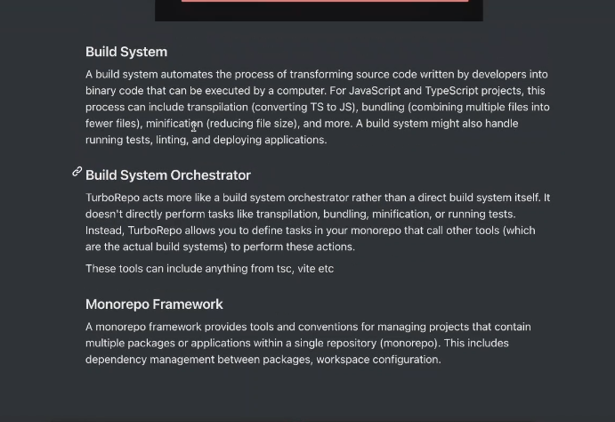

https://projects.100xdevs.com/tracks/monorepo/monorepo-1

//Build System
Vite Ts is build System as it work as compiler
 

//Build system orchestroion means first that folder has build on which other folder dependent and then only other folders build

Lerna and NX is the Monorepo Framework

Turborepo and Monorepo are not same

Turborepo is not exactly a monorepo framework

