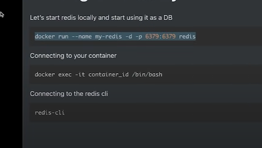
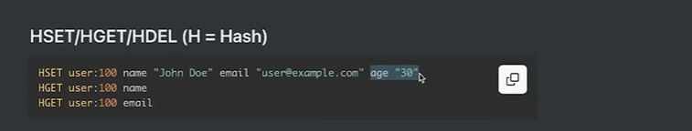

//Set data in redis
SET key value
Example
SET user "Anurag"

//GET data
GET key
GET user

//Delete Data
DEL key
DEl user

//Push in REDIS QUEUE
LPUSH problem 1 //Pushing from left side
LPUSH problem 2 //Pushing from left side
Example
LPUSH problems "{problemId:1,userId:1,...}"
//POP in REDIS QUEUE
RPOP problem 1 //Pushing from left side
RPOP problem 2 //Pushing from left side
//Example
RPOP problems 

//BRPOP will use to block the queue till no one push the data

BRPOP problem time 0 means infinite 5 means 5 sec
Example
BRPOP problem 0 will block the queue till no data is pushed 
BRPOP problem 5 will block the queue for 5 sec only