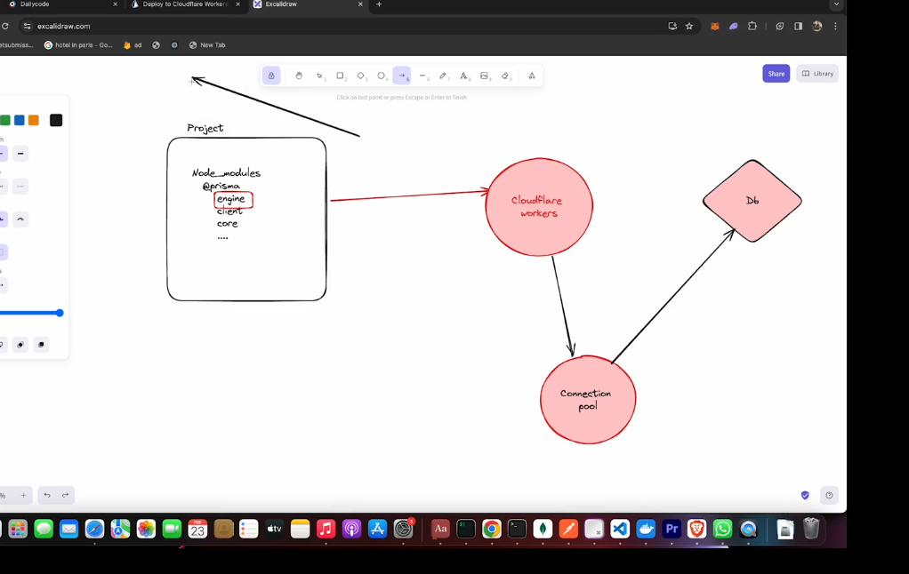

```txt
npm install
npm run dev
```

```txt
npm run deploy
```

[For generating/synchronizing types based on your Worker configuration run](https://developers.cloudflare.com/workers/wrangler/commands/#types):

```txt
npm run cf-typegen
```

Pass the `CloudflareBindings` as generics when instantiation `Hono`:

```ts
// src/index.ts
const app = new Hono<{ Bindings: CloudflareBindings }>()
```


```
Connection Pooling

A pool that connected to all the workers
and only single link to connect with database 


primsa include some node specific modules so they don't directly engage with cloudflare 

so this is how we connect to db
 


```
